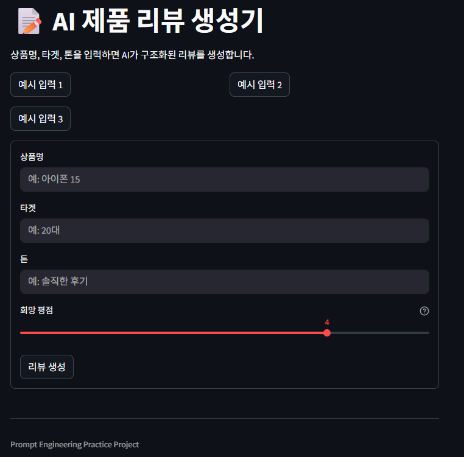

# 📝 AI 제품 리뷰 생성기

> 프롬프트 엔지니어링 기반으로
> 구조화된 AI 결과를 생성하고 검증하는 웹 애플리케이션

---

## 🚀 프로젝트 소개

사용자가 상품명, 타겟, 톤, 희망 평점을 입력하면
AI가 **일관된 JSON 구조의 제품 리뷰**를 생성하는 Streamlit 웹앱입니다.

단순 텍스트 생성이 아닌,
**출력 형식 제어 + 검증 + 재시도 로직**을 포함한
실제 서비스 형태를 목표로 구현했습니다.

---

## ❗ 문제 정의

LLM을 활용할 때 다음 문제가 발생합니다:

* 출력 형식이 깨짐 (JSON 불안정)
* 불필요한 설명문 포함
* 데이터 구조 불일치
* 결과 품질의 일관성 부족

---

## 💡 해결 방법

이 프로젝트에서는 다음 방식으로 문제를 해결했습니다:

### 1. 프롬프트 설계

* JSON 출력 강제
* 배열 길이 및 타입 명시
* tone / target 기반 스타일 제어

### 2. 응답 정제 (Sanitization)

* Markdown 코드 블록 제거
* 순수 JSON 형태로 변환

### 3. 검증 로직 (Validation)

* 필수 키 존재 여부 확인
* rating 범위 체크 (1~5)
* pros / cons 길이 검증

### 4. 재시도 로직 (Retry)

* 검증 실패 시 자동 재요청
* 최대 3회 제한으로 안정성 확보

---

## 🛠 주요 기능

* 상품명 / 타겟 / 톤 입력 UI
* ⭐ 희망 평점 슬라이더
* 📌 예시 입력 버튼
* 🤖 AI 리뷰 생성
* 🧹 JSON 정제 및 파싱
* ✅ 출력 검증
* 🔁 자동 재시도
* 🎨 카드 형태 결과 UI

---

## 🧱 기술 스택

* Python
* Streamlit
* OpenAI API
* python-dotenv

---

## 📂 파일 구조

```text
ai-review-generator/
├─ app.py
├─ review_generator.py
├─ .gitignore
├─ requirements.txt
└─ README.md
```

※ `.env` 파일은 보안상 포함하지 않습니다.

---

## ⚙ 실행 방법

```bash
pip install -r requirements.txt
streamlit run app.py
```

---

## 📸 실행 화면

```md

```

---

## 📈 핵심 학습 포인트

이 프로젝트를 통해 다음을 직접 구현했습니다:

* 프롬프트 기반 구조화 출력 설계
* LLM 출력 안정화 처리
* JSON 파싱 및 검증 로직
* 재시도 기반 안정성 확보
* 콘솔 프로그램을 웹 애플리케이션으로 확장

---

## 🔥 개선 방향

* 리뷰 저장 기능 (DB 연동)
* CSV 다운로드 기능
* 여러 리뷰 비교 기능
* 사용자 로그인 기능
* 배포 및 공개 URL 제공

---

## 🧠 느낀 점

단순히 프롬프트를 잘 작성하는 것보다
**AI 출력을 안정적으로 제어하고 검증하는 것이 중요함**을 배웠습니다.

또한, 콘솔 프로그램을 웹 애플리케이션으로 확장하면서
실제 서비스 형태로 발전시키는 경험을 할 수 있었습니다.